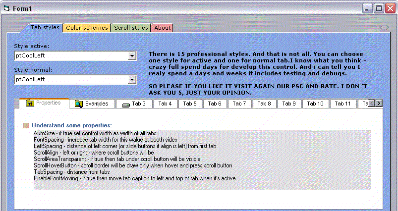



## ProTab

### Description

This is coll tab control with 15 tab styles, 2 color schemes, top and bottom orientation, icon support, 3 scroll buttons styles, full design time edit, autosize property, tooltips, nice designed PropertyPages and much more.

You can choose diferent style for active tab and for normal (inactive) tab. That gives you much options and you can design amazing tab controls.

I don't know what more to say, TRY IT AND PLEASE (IF YOU LIKE IT) RATE IT.

Thanks!
 
### More Info
 

             |
---                |---
**Submitted On**   |2007-01-05 12:25:02
**By**             |[ivan stimac](https://github.com/Planet-Source-Code/PSCIndex/blob/master/ByAuthor/ivan-stimac.md)
**Level**          |Intermediate
**User Rating**    |4.8 (91 globes from 19 users)
**Compatibility**  |VB 6\.0
**Category**       |[OLE/ COM/ DCOM/ Active\-X](https://github.com/Planet-Source-Code/PSCIndex/blob/master/ByCategory/ole-com-dcom-active-x__1-29.md)
**World**          |[Visual Basic](https://github.com/Planet-Source-Code/PSCIndex/blob/master/ByWorld/visual-basic.md)
**Archive File**   |[ProTab204111152007\.zip](https://github.com/Planet-Source-Code/ivan-stimac-protab__1-67558/archive/master.zip)

